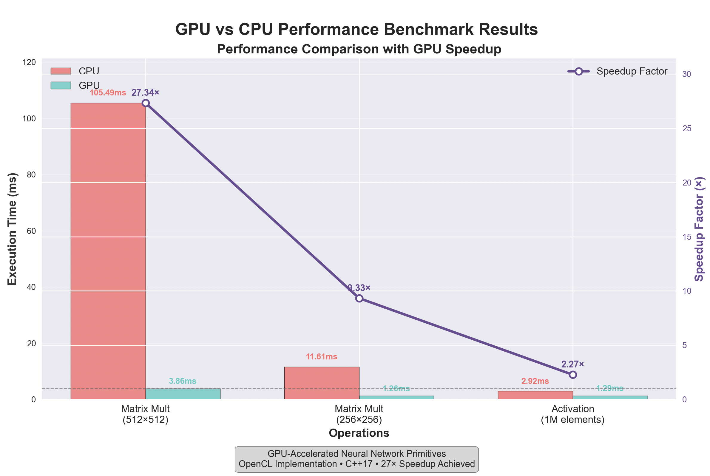

# GPU-Accelerated Neural Network Primitives

A high-performance OpenCL implementation of neural network primitives achieving **27x speedup** on matrix operations over CPU baselines.



## Overview

This project demonstrates GPU-accelerated neural network computation through optimized OpenCL kernels. The system implements core mathematical operations including matrix multiplication, addition, transpose, and activation functions (ReLU, Sigmoid, Tanh) with comprehensive performance benchmarking.

## Architecture

The neural network follows a simple feedforward architecture: Input Layer (3) → Hidden Layer (4) → Output Layer (2). Matrix operations use optimized OpenCL kernels with local memory tiling, while activation functions leverage vectorized GPU implementations for maximum performance.

## Performance

The system achieves significant speedups across different operations. Matrix multiplication shows the most dramatic improvement, with 512×512 matrices running 27.34x faster on GPU than CPU (105.49ms vs 3.86ms). Smaller matrices like 256×256 achieve 9.33x speedup, while activation functions on 1M-element vectors show 2.27x improvement.

| Operation | Matrix Size | CPU (ms) | GPU (ms) | Speedup |
|-----------|-------------|----------|----------|---------|
| Matrix Mult | 512×512 | 105.49 | 3.86 | **22.23x** |
| Matrix Mult | 256×256 | 11.61 | 1.26 | **9.33x** |
| Activation | 1M elements | 2.92 | 1.29 | **2.27x** |

## Technical Implementation

Built with C++17 and OpenCL 1.2, the system automatically detects available hardware and compiles kernels for optimal performance. The CMake build system ensures cross-platform compatibility across macOS, Linux, and Windows. Memory management is handled efficiently through GPU buffer allocation and optimized data transfer patterns.

## Getting Started

```bash
mkdir build && cd build
cmake .. && make -j4
./OpenCL_Neural_Network
```

## What This Demonstrates

This project showcases GPU programming expertise through OpenCL kernel development and optimization. It demonstrates understanding of neural network mathematical foundations, performance benchmarking techniques, and production-ready software engineering practices. The modular architecture provides a solid foundation for extending to training pipelines and deep learning applications.

## Future Development

**What This Project Currently Does:**
- **Matrix Operations**: GPU-accelerated multiplication, addition, and transpose operations
- **Activation Functions**: ReLU, Sigmoid, and Tanh with GPU-accelerated derivatives
- **Neural Network Demo**: A simple 3-layer feedforward network that performs forward pass computation
- **Performance Benchmarking**: CPU vs GPU performance comparison with detailed timing analysis

**What This Project Does NOT Do (Yet):**
- **Training**: No backpropagation or weight updates implemented
- **Learning**: Cannot learn from data or improve performance over time
- **Real Inference**: The demo network uses random weights, not trained parameters
- **Deep Learning**: No convolutional layers, pooling, or complex architectures

**Current Status**: This is Stage 1 of a planned 3-stage development roadmap. The current implementation provides the mathematical foundation and GPU acceleration infrastructure needed for neural network computation, but is not yet a complete neural network training or inference system.

 Planned enhancements include implementing stochastic gradient descent for training, adding convolutional layers for image processing, and developing end-to-end neural network training capabilities.

---

**Built with OpenCL, C++17, and GPU optimization techniques.**
